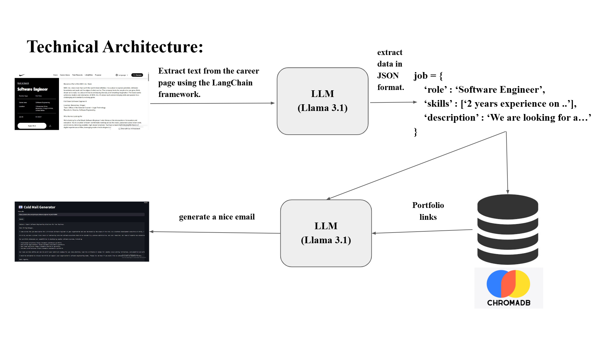

 <!-- Architecture / System Overview Image -->


# GenAI Cold Email Generator

🧠 Llama 3.1 | 🐍 Python | ⚡ GROQ | 🗂️ ChromaDB | 🌐 Web Scraping

## Tools & Technologies 🛠️

* **LangChain** – Extracts text from career pages
* **Llama 3.1** – Extracts job data and generates cold emails
* **ChromaDB** – Vector database for skill and portfolio matching
* **GROQ** – Cloud-based inference for fast Llama 3.1 responses using LPU

---

## Project Overview

**GenAI Cold Email Generator** helps software companies send cold emails to acquire projects by extracting data from their potential clients’ job postings and matching the required skills with their portfolios stored in the company’s database. The goal is to effectively reach and secure clients by generating highly relevant cold emails.

---

## Problem Statement

Software services companies (such as Vivasoft, Optimizely, Enosis, etc.) help clients (for example, Australian Red Cross, RAKBANK, L’Oréal, etc.) build software. This market is highly competitive, and sales teams use various marketing techniques to acquire projects. One common technique is **cold emailing**.

Typically, a company identifies potential clients by scanning their job portals. For instance, if a job post indicates a requirement for a software engineer in AI/ML, the sales team may send a cold email suggesting an alternative to full-time hiring—such as hiring engineers on a contract basis.

Many companies hire talent from countries like Bangladesh, India, or Indonesia on a contractual basis with lower budgets, which makes cold emailing an effective strategy.

However, sales representatives or business development executives must manually analyze job postings and craft relevant emails. This process can be automated using a **Large Language Model (LLM)**.

This project builds a tool where:

* A job posting is provided as input
* The system identifies required skills
* A relevant cold email is generated that directly addresses those skills
* Portfolio links related to the required skills are included

For example, if a job post requires **ML with Python and DevOps**, the generated email will specifically highlight experience and portfolio projects related to those skills.

---

## Technical Architecture 🧠⚙️
<p align="center">
  
</p>

### 1. Job Post Extraction 📄

* Text is extracted from the career page using the **LangChain framework**.

### 2. Job Information Structuring 🧩

* **Llama 3.1** is used to extract structured information from the job post.
* The extracted data is converted into JSON format:

```json
{
  "role": "Software Engineer",
  "skills": ["2 years experience on .."],
  "description": "We are looking for a…"
}
```

### 3. Portfolio Matching 🔍

* The extracted job data is sent to **ChromaDB**, a vector database.
* ChromaDB already contains stored skills and relevant portfolio links for the company.
* Matching portfolio links are retrieved based on the job requirements.

### 4. Cold Email Generation ✉️

* The job description (JSON) and matched portfolio links are passed to **Llama 3.1**.
* The LLM generates a tailored and relevant cold email.

---

## LLM and Inference Setup

* **Llama 3.1** is an open-source LLM that can be used for free.
* While Llama 3.1 can be run locally or via Ollama, both options are relatively slow.
* This project uses **GROQ** to run Llama 3.1 in the cloud.
* GROQ provides fast inference using **LPU (Language Processing Unit)**, ensuring quick response times when generating emails.

---

<p align="center">
  
</p>


